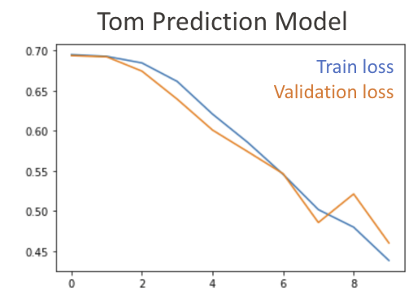
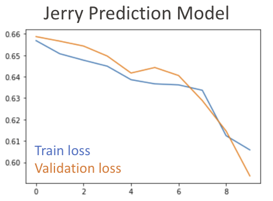
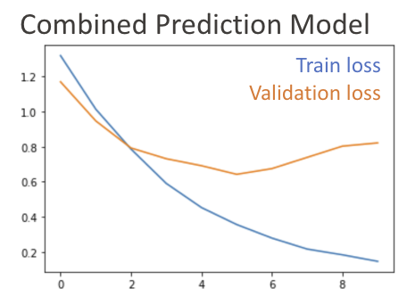

# Tom and Jerry Classification
using deep learning to classify Tom &amp; Jerry from images

### 🚀 Goal
Find Tom and Jerry in images with Convolutional Neural Network 

### 🗃 [Data](https://www.kaggle.com/datasets/balabaskar/tom-and-jerry-image-classification?select=ground_truth.csv)
This dataset contains more than 5478 images extracted from some of Tom & Jerry's show videos. Each image is labeled with "Tom only", "Jerry only", "Tom and Jerry", or "No Tom or Jerry". 

### Approach 1:
We built 2 seperate binary classifers for Tom and Jerry individually, and we trained each model for 10 epochs. 
The Tom model produces a train accuracy of 99% and a validation accuracy of 93%. 
The Jerry model produces a train accuracy of 99% and a validation accuracy of 91%. 

    

### Approach 2:
We labelled images with one of the 4 labels:
* No Tom or Jerry = 0
* Tom only = 1
* Jerry only = 2
* Tom and Jerry = 3

We built a multi-class classifer for this setting, and we trained each model for 10 epochs. 
The model produces a train accuracy of 97% and a validation accuracy of 80%. 

    
